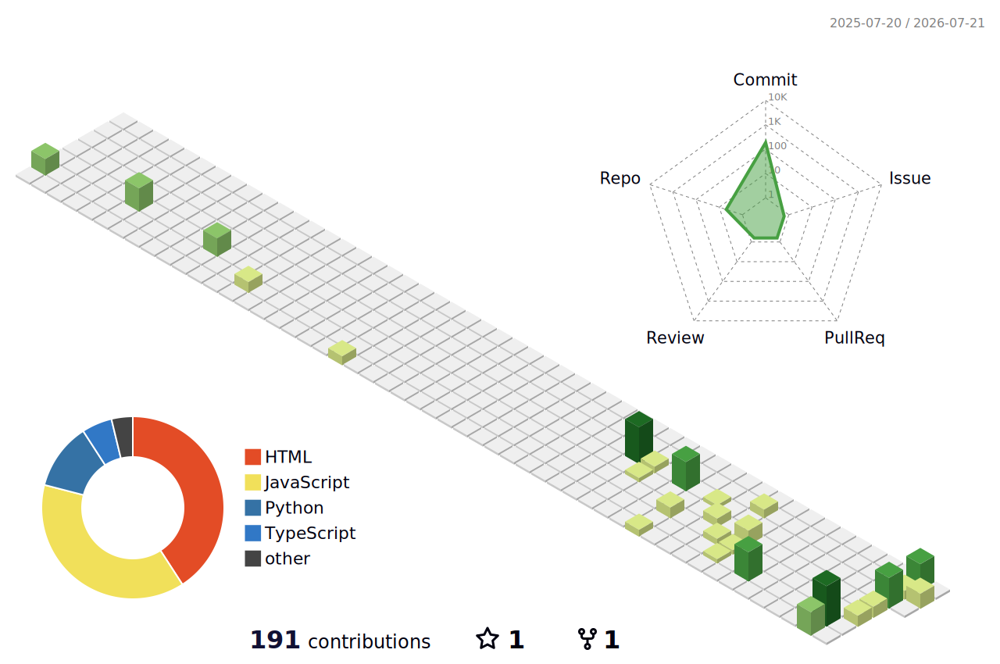

<!--
===============================================================================
  HZIFA33 — GITHUB PROFILE README
  Public identity: Hozaifa Abozaid
  Visual system: Midnight Navy + Cyan + Gold
===============================================================================

PROFILE STRATEGY — MAINTAIN THIS HIERARCHY
------------------------------------------
1. ABOVE THE FOLD
   • Name, role, specialization, location and one clear destination.
   • A visitor should understand the profile in under ten seconds.
   • Keep the hero visually strong but avoid large GIF files.

2. POSITIONING
   • Lead with outcomes: Arabic-first, multilingual and offline-capable products.
   • Present the combination of software, IT, customer experience and languages
     as a differentiator—not as disconnected roles.

3. PROOF BEFORE TOOLING
   • Show flagship products before listing every technology.
   • Describe the problem, users, product value and engineering decisions.
   • Keep forked repositories out of the featured area.

4. PROJECT CURATION
   • Pin only original, complete and actively maintained repositories.
   • Recommended order:
       1) raff
       2) ibnmuslim
       3) quraanroot
       4) RTVE-subdl
       5) strongest original web project
       6) strongest original utility
   • Every pinned repository should have:
       - a concise description
       - topics
       - screenshots
       - installation steps
       - release notes
       - license
       - a polished repository README

5. VISUAL DESIGN
   • Reuse the same navy/cyan/gold palette throughout the profile.
   • Use badges as metadata, not decoration.
   • Use SVG wherever possible for sharpness, speed and dark/light support.
   • Use no more than two columns for mobile readability.

6. DYNAMIC CONTENT
   • GitHub Actions generates the contribution snake and 3D calendar locally.
   • External widgets are reserved for lightweight summary cards.
   • Keep meaningful alt text so the profile remains understandable if an image
     provider is unavailable.

7. TRUST AND ACCESSIBILITY
   • Do not publish personal phone numbers, private email addresses or secrets.
   • Avoid inflated metrics and technologies you cannot discuss confidently.
   • Use descriptive link text and image alt text.
   • Do not rely on color alone to communicate meaning.

8. INTERNATIONAL SIGNAL
   • English is the main public language for global reach.
   • Arabic and Spanish summaries demonstrate multilingual communication without
     duplicating the whole README.

9. CONVERSION
   • End with one strong call to action and a small number of contact links.
   • The portfolio is the primary destination; GitHub repositories provide proof.

10. MAINTENANCE
   • Review this file monthly.
   • Update “Current Focus” whenever priorities change.
   • Replace outdated project claims and dead services immediately.
   • Re-run the Profile Assets workflow after changing its configuration.
===============================================================================
-->

  

  

  
  
  
  
  

  <a href="#about-me">About</a>
  ·
  <a href="#featured-products">Products</a>
  ·
  <a href="#technology-ecosystem">Stack</a>
  ·
  <a href="#github-intelligence">Analytics</a>
  ·
  <a href="#languages--perspective">Languages</a>
  ·
  <a href="#connect">Connect</a>

 

## About Me

<table>
  <tr>
    <td width="27%" align="center" valign="middle">
      
        
      
    </td>
    <td width="73%" valign="middle">
      <h3>Product-minded engineering for real-world needs</h3>
      

        I build practical web and desktop products with a strong focus on
        <strong>Arabic-first user experience</strong>,
        <strong>multilingual interfaces</strong>,
        <strong>offline reliability</strong>, and
        <strong>clear product design</strong>.
      

      

        My background combines software development, IT support, customer service,
        digital communication, and language studies. That mix helps me design
        products around how people actually work—not only around what the code can do.
      

      

        I am especially interested in open-source tools, education platforms,
        information management systems, accessible interfaces, and software that
        respects user privacy.
      

    </td>
  </tr>
</table>

<table>
  <tr>
    <td width="25%" align="center">
      <strong>5+</strong> 
      Years of experience
    </td>
    <td width="25%" align="center">
      <strong>50+</strong> 
      Projects completed
    </td>
    <td width="25%" align="center">
      <strong>Arabic First</strong> 
      Native RTL thinking
    </td>
    <td width="25%" align="center">
      <strong>3 Languages</strong> 
      Arabic · English · Spanish
    </td>
  </tr>
</table>

 

## Engineering Identity

<table>
  <tr>
    <td width="33%" align="center" valign="top">
      
        
      <strong>Product Engineering</strong>
       
      From discovery and architecture to release and iteration.
    </td>
    <td width="33%" align="center" valign="top">
      
        
      <strong>Arabic & Multilingual UX</strong>
       
      RTL and LTR experiences designed as first-class systems.
    </td>
    <td width="33%" align="center" valign="top">
      
        
      <strong>Offline-First Desktop</strong>
       
      Reliable local workflows with privacy and continuity.
    </td>
  </tr>
  <tr>
    <td width="33%" align="center" valign="top">
      
        
      <strong>Open Source</strong>
       
      Useful releases, transparent code, and clear documentation.
    </td>
    <td width="33%" align="center" valign="top">
      
        
      <strong>Delivery & Operations</strong>
       
      CI/CD, cloud deployment, releases, backups, and observability.
    </td>
    <td width="33%" align="center" valign="top">
      
        
      <strong>Human-Centered UX</strong>
       
      Interfaces informed by customer support and real user behavior.
    </td>
  </tr>
</table>

 

## Featured Products

### رَفّ — Arabic Library Management System

<table>
  <tr>
    <td width="15%" align="center" valign="middle">
      
    </td>
    <td width="85%" valign="middle">
      <strong>Open-source, offline-first software for libraries, publishers, schools, research centers, mosques, and book collections.</strong>
        
      Cataloging, Arabic-normalized search, circulation, multi-volume loans, partial returns,
      barcode labels, inventory intelligence, backups, exports, and data-integrity tools in a
      native RTL desktop experience.
        
      
      
      
      
      
      
      
        
      
      
      
      
      
      
    </td>
  </tr>
</table>

### Ibn Muslim Academy — Multilingual Education Platform

<table>
  <tr>
    <td width="15%" align="center" valign="middle">
      
    </td>
    <td width="85%" valign="middle">
      <strong>A multilingual educational experience designed for Arabic and international audiences.</strong>
        
      Responsive language routes, native RTL/LTR layouts, interactive course experiences,
      AI-assisted guidance, cloud functions, secure contact workflows, and optimized delivery
      through Cloudflare.
        
      
      
      
      
      
        
      
      
      
      
      
    </td>
  </tr>
</table>

### More Original Work

<table>
  <tr>
    <td width="50%" valign="top">
      <strong><a href="https://github.com/Hzifa33/quraanroot">Quraan Root</a></strong>
       
      A focused project exploring Qur’anic and Arabic-language information through a practical digital experience.
        
      
      
      
    </td>
    <td width="50%" valign="top">
      <strong><a href="https://github.com/Hzifa33/RTVE-subdl">RTVE Subtitle Downloader</a></strong>
       
      A Python utility created to streamline subtitle retrieval and automate repetitive media workflows.
        
      
      
      
    </td>
  </tr>
</table>

  

 

## Current Focus

<table>
  <tr>
    <td width="25%" align="center" valign="top">
      
        
      <strong>Desktop Product</strong>
       
      Refining Raf for larger libraries, faster workflows, and stronger data integrity.
    </td>
    <td width="25%" align="center" valign="top">
      
        
      <strong>Modern Web</strong>
       
      Building responsive interfaces with React, TypeScript, Vite, and Tailwind.
    </td>
    <td width="25%" align="center" valign="top">
      
        
      <strong>Localization</strong>
       
      Improving multilingual architecture, Arabic typography, and RTL/LTR consistency.
    </td>
    <td width="25%" align="center" valign="top">
      
        
      <strong>Delivery</strong>
       
      Strengthening releases, CI workflows, deployment, documentation, and maintenance.
    </td>
  </tr>
</table>

 

## Technology Ecosystem

  

  
  
  
  
  

  
<strong>How I use this stack</strong>

   

| Layer | What I focus on |
|---|---|
| Interface | Information hierarchy, responsive layouts, dark/light themes, motion, accessibility, RTL/LTR |
| Application | State, validation, search, filtering, imports/exports, local-first workflows |
| Desktop | Electron architecture, secure preload bridges, packaging, installers, releases |
| Automation | Python and PowerShell utilities, data processing, build and release workflows |
| Delivery | Git, GitHub Actions, Cloudflare, Netlify, environment configuration, security headers |
| Quality | Error handling, backups, data integrity, performance, maintainability, documentation |

 

## Product Principles

<table>
  <tr>
    <td width="50%" valign="top">
      <strong>01 — Start with the user’s real workflow</strong>
       
      Software should reduce steps, ambiguity, repeated work, and avoidable errors.
    </td>
    <td width="50%" valign="top">
      <strong>02 — Make Arabic a native experience</strong>
       
      RTL, typography, search normalization, spacing, and content structure belong in the architecture.
    </td>
  </tr>
  <tr>
    <td width="50%" valign="top">
      <strong>03 — Reliability is a feature</strong>
       
      Backups, safe writes, clear errors, offline access, and recoverable data are part of UX.
    </td>
    <td width="50%" valign="top">
      <strong>04 — Ship complete products</strong>
       
      A project includes installation, documentation, releases, security, and maintenance—not only source code.
    </td>
  </tr>
  <tr>
    <td width="50%" valign="top">
      <strong>05 — Design for every screen</strong>
       
      Interfaces should remain understandable, touch-friendly, and visually balanced on mobile and desktop.
    </td>
    <td width="50%" valign="top">
      <strong>06 — Keep the interface calm</strong>
       
      Strong hierarchy and purposeful motion matter more than visual noise.
    </td>
  </tr>
</table>

 

## GitHub Intelligence

  <picture>
    <source
      media="(prefers-color-scheme: dark)"
      srcset="https://github-profile-summary-cards.vercel.app/api/cards/profile-details?username=Hzifa33&theme=github_dark"
    />
    
  </picture>

  <picture>
    <source
      media="(prefers-color-scheme: dark)"
      srcset="https://github-profile-summary-cards.vercel.app/api/cards/stats?username=Hzifa33&theme=github_dark"
    />
    
  </picture>
  <picture>
    <source
      media="(prefers-color-scheme: dark)"
      srcset="https://github-profile-summary-cards.vercel.app/api/cards/most-commit-language?username=Hzifa33&theme=github_dark"
    />
    
  </picture>

  <picture>
    <source
      media="(prefers-color-scheme: dark)"
      srcset="https://streak-stats.demolab.com?user=Hzifa33&theme=github-dark-blue&hide_border=true&background=00000000"
    />
    
  </picture>

  <picture>
    <source
      media="(prefers-color-scheme: dark)"
      srcset="https://github-readme-activity-graph.vercel.app/graph?username=Hzifa33&theme=github-compact&hide_border=true&area=true&custom_title=Contribution%20Activity"
    />
    
  </picture>

### 3D Contribution Calendar

  <picture>
    <source
      media="(prefers-color-scheme: dark)"
      srcset="./profile-3d-contrib/profile-night-green.svg"
    />
    
  </picture>

### Contribution Snake

  <picture>
    <source
      media="(prefers-color-scheme: dark)"
      srcset="https://raw.githubusercontent.com/Hzifa33/Hzifa33/output/github-contribution-grid-snake-dark.svg"
    />
    
  </picture>

The 3D calendar and contribution snake are generated automatically by the workflow included with this profile repository.

  

## Languages & Perspective

<table>
  <tr>
    <td width="33%" align="center">
      
        
      Native communication and Arabic-first product thinking.
    </td>
    <td width="33%" align="center">
      
        
      Technical documentation, collaboration, and product communication.
    </td>
    <td width="33%" align="center">
      
        
      Languages and Translation background with continued study.
    </td>
  </tr>
</table>

  
<strong>العربية — نبذة مختصرة</strong>

   
  أنا مطوّر برمجيات ومتخصص في تقنية المعلومات، أركز على بناء منتجات عربية ومتعددة اللغات تعمل بكفاءة على الويب وسطح المكتب. أهتم بتجربة المستخدم، ودعم اتجاه الكتابة من اليمين إلى اليسار، والخصوصية، والعمل دون إنترنت، وتحويل المشكلات الواقعية إلى أدوات عملية مفتوحة المصدر.

  
<strong>Español — Resumen</strong>

   
  Soy desarrollador de software y especialista en tecnología de la información. Me centro en crear productos web y de escritorio útiles, multilingües y accesibles, con especial atención a las experiencias en árabe, el diseño RTL, la privacidad, el funcionamiento sin conexión y el código abierto.

  
<strong>Education & professional perspective</strong>

   

- BA in Languages and Translation — Spanish Language and Literature.
- Upper Second-Class Honours (2:1), graduating second in class.
- Experience spanning customer service, IT support, web development, desktop software, and digital communication.
- This background strengthens requirements discovery, user empathy, documentation, localization, and product communication.

 

## Open-Source Commitment

> I believe useful knowledge deserves reliable tools, and reliable tools deserve clear documentation, respectful design, and a path for others to improve them.

- Build software that solves identifiable problems.
- Keep important user data local when cloud dependence is unnecessary.
- Publish understandable releases and installation instructions.
- Separate essential product value from visual decoration.
- Welcome useful feedback and convert it into measurable improvements.
- Design Arabic software with the same care expected from global products.

 

## Connect

  <strong>Interested in useful software, Arabic-first products, educational technology, or open-source collaboration?</strong>

  
  
  

  
  
  

  <strong>Building useful software with clarity, purpose, and respect for the user.</strong>

  

