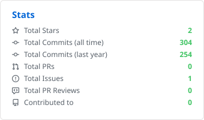
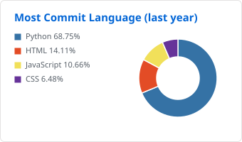
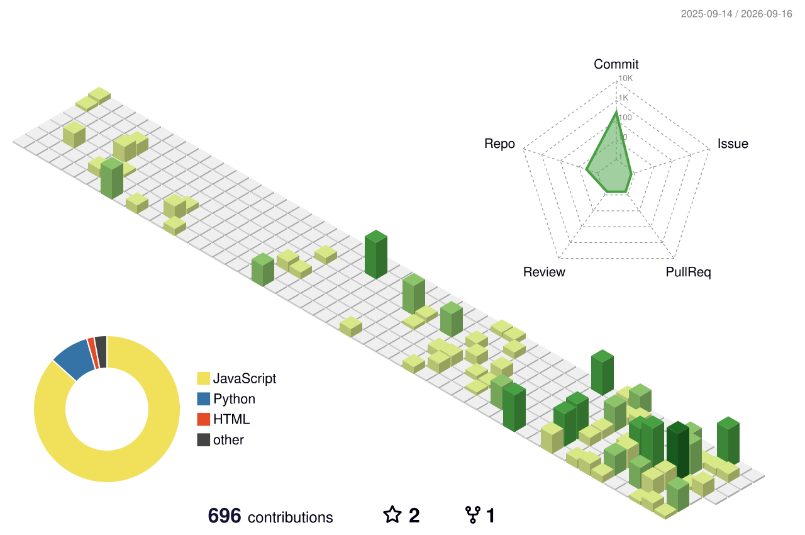

<!--
  Hzifa33 · GitHub profile README
  All custom artwork is bundled in ./assets/profile/ (upload the entire ZIP).
  Official logo: https://hzifa33.com/assets/logo.svg (the only external image).
  Existing statistics workflow and its local output have been preserved.
-->

  
   
  <b>HZIFA33</b> &nbsp;·&nbsp; PRODUCT DEVELOPMENT &nbsp;·&nbsp; OPEN SOURCE

  

  <a href="https://hzifa33.com"><b>Portfolio ↗</b></a> &nbsp; • &nbsp;
  <a href="https://hzifa33.com/tools"><b>Explore HozTools ↗</b></a> &nbsp; • &nbsp;
  <a href="https://github.com/Hzifa33?tab=repositories"><b>Repositories ↗</b></a>

  <a href="#selected-work">Selected work</a> &nbsp; / &nbsp;
  <a href="#toolkit">Toolkit</a> &nbsp; / &nbsp;
  <a href="#github-activity">Activity</a> &nbsp; / &nbsp;
  <a href="#connect">Connect</a>

---

### Hey, I’m Hozaifa 👋

I’m a software developer based in Egypt, building **useful web and desktop products** with care for the details people actually notice: clear interfaces, intuitive workflows, thoughtful localization and reliable everyday use.

My work focuses on **Arabic-first UX**, multilingual experiences, privacy-conscious browser tools and offline-capable desktop software. I bring software development and language studies together to make products feel natural to their users.

> **Design the experience. Build the product. Keep it useful.**

## Selected work

<!-- Cover images are local repository assets. Upload the ENTIRE package, not README.md alone. -->

**HozTools** · [Open the tools ↗](https://hzifa33.com/tools) · [Website ↗](https://hzifa33.com)

A growing collection of everyday browser utilities, including image editing, PDF workflows and QR tools. Designed to be straightforward on both mobile and desktop, with privacy-conscious workflows.

**رَفّ — Raff** · [Source code ↗](https://github.com/Hzifa33/raff) · [Releases ↗](https://github.com/Hzifa33/raff/releases)

An Arabic-first, offline library management system for cataloguing, circulation, barcode labels, inventory, backups and dependable data handling.

**Ibn Muslim Academy** · [Visit website ↗](https://ibnmuslimacademy.com) · [Source code ↗](https://github.com/Hzifa33/ibnmuslim)

A multilingual educational web experience designed around responsive layouts and considered Arabic/English RTL–LTR localization.

<b>More projects · Quraan Root, RTVE Subtitle Downloader and other work</b>

 

| Project | Focus |
| :-- | :-- |
| [Quraan Root](https://github.com/Hzifa33/quraanroot) | Exploring Arabic and Qur’anic-language information through digital tools. |
| [RTVE Subtitle Downloader](https://github.com/Hzifa33/RTVE-subdl) | Automating subtitle retrieval and repetitive media workflows with Python. |
| [All repositories](https://github.com/Hzifa33?tab=repositories) | Browse more open-source tools and experiments. |

---

## Toolkit

| Product interfaces | Apps & automation | Delivery |
| :-- | :-- | :-- |
| React · TypeScript · JavaScript | Electron · Node.js · Python | Git · GitHub Actions · Cloudflare |
| HTML · CSS · Tailwind CSS | Browser APIs · API integration | Responsive design · Accessibility · RTL / LTR |

**What guides my work:** practical workflows, clear visual hierarchy, native Arabic support, thoughtful performance and documentation that helps people get started.

## GitHub activity

<b>Explore my GitHub statistics and contribution calendar ↗</b>

 

The cards below are stored in this repository and refreshed by the included profile workflow.

  
  

  

---

## Beyond code

I studied **Spanish Language and Literature** and enjoy working across languages and cultures. My technical interests meet communication and design in products that serve people in Arabic, English and Spanish.

<b>العربية · نبذة مختصرة</b>

 

أنا حذيفة، مطوّر برمجيات أهتم ببناء أدوات للويب وسطح المكتب تركز على سهولة الاستخدام، ودعم اللغة العربية بصورة أصيلة، والخصوصية، والعمل دون اتصال بالإنترنت.

<b>Español · Sobre mí</b>

 

Soy desarrollador de software y me interesa crear herramientas útiles para la web y el escritorio, con especial atención a las interfaces multilingües, la experiencia en árabe, la accesibilidad y la privacidad.

## Connect

Interested in building useful products, multilingual software or collaborating on open-source projects? I’d love to hear about your idea.

  <a href="https://hzifa33.com"><b>hzifa33.com ↗</b></a> &nbsp; · &nbsp;
  <a href="https://hzifa33.com/tools"><b>HozTools ↗</b></a> &nbsp; · &nbsp;
  <a href="https://github.com/Hzifa33"><b>@Hzifa33 ↗</b></a>

Crafted with care · © Hzifa33

