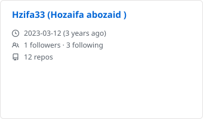

<!--
  HZIFA33 · Profile README
  Visual language: midnight / ice / turquoise / muted gold / amethyst.
  Official logo is intentionally loaded from https://hzifa33.com/assets/logo.svg
  and is not redrawn. Replace that URL in both logo references if it moves.
  Hero and project artwork are self-contained local SVG files in assets/brand/.
  Statistics and contribution art remain generated by the original workflow.
-->

<!-- BRAND / IDENTITY -->

  

  <a href="https://hzifa33.com"><strong>HZIFA33.COM</strong></a>
  &nbsp;·&nbsp; PRODUCT ENGINEERING &nbsp;·&nbsp; OPEN SOURCE

  <picture>
    <source media="(prefers-color-scheme: dark)" srcset="./assets/brand/hero-dark.svg" />
    <source media="(prefers-color-scheme: light)" srcset="./assets/brand/hero-light.svg" />
    
  </picture>

  <strong>Building useful software that feels effortless to use.</strong> 
  Web experiences · Offline-first desktop apps · Arabic &amp; multilingual UX

  
  
  

  <a href="#selected-work">Selected work</a> &nbsp;·&nbsp;
  <a href="#how-i-build">How I build</a> &nbsp;·&nbsp;
  <a href="#github-activity">GitHub activity</a> &nbsp;·&nbsp;
  <a href="#lets-connect">Connect</a>

---

### A little about me

I’m **Hozaifa Abozaid** (`@Hzifa33`), a software developer based in Egypt. I design and build products with an emphasis on **clear interfaces, privacy, localization, and dependable everyday workflows**. My background in language studies and customer-facing work shapes the way I think about usability: good software should make sense to the people using it.

**What I care about:** Arabic-first experiences that get RTL right · multilingual web products · offline-capable tools · thoughtful open-source software.

---

## Selected work

*Working products first. Tools and technologies come second.*

<!-- FEATURE 01 -->
<a href="https://hzifa33.com/tools">
  <picture>
    <source media="(prefers-color-scheme: dark)" srcset="./assets/brand/tools-dark.svg" />
    <source media="(prefers-color-scheme: light)" srcset="./assets/brand/tools-light.svg" />
    
  </picture>
</a>

**[HozTools](https://hzifa33.com/tools)** — A collection of useful browser-based tools for everyday tasks, built with a clean interface and a privacy-conscious approach. Explore image utilities, PDF workflows, QR tools, and more in one place.

[Open HozTools ↗](https://hzifa33.com/tools) · [Visit my website ↗](https://hzifa33.com)

<!-- FEATURE 02 -->
<a href="https://github.com/Hzifa33/raff">
  <picture>
    <source media="(prefers-color-scheme: dark)" srcset="./assets/brand/raff-dark.svg" />
    <source media="(prefers-color-scheme: light)" srcset="./assets/brand/raff-light.svg" />
    
  </picture>
</a>

**[رَفّ / Raff](https://github.com/Hzifa33/raff)** — An open-source, Arabic-first desktop system for library workflows: cataloguing, circulation, search, barcode labels, inventory, backups, and data integrity. Designed for native RTL use and offline continuity.

[View source ↗](https://github.com/Hzifa33/raff) · [Browse releases ↗](https://github.com/Hzifa33/raff/releases)

<!-- FEATURE 03 -->
<a href="https://ibnmuslimacademy.com">
  <picture>
    <source media="(prefers-color-scheme: dark)" srcset="./assets/brand/academy-dark.svg" />
    <source media="(prefers-color-scheme: light)" srcset="./assets/brand/academy-light.svg" />
    
  </picture>
</a>

**[Ibn Muslim Academy](https://ibnmuslimacademy.com)** — A multilingual educational web experience with responsive layouts and thoughtful RTL/LTR localization.

[Visit website ↗](https://ibnmuslimacademy.com) · [View source ↗](https://github.com/Hzifa33/ibnmuslim)

  
<strong>More projects worth exploring</strong>

   

  | Project | What it does |
  | :-- | :-- |
  | [Quraan Root](https://github.com/Hzifa33/quraanroot) | An exploration of Arabic and Qur’anic-language information through digital tools. |
  | [RTVE Subtitle Downloader](https://github.com/Hzifa33/RTVE-subdl) | A Python utility for streamlining subtitle retrieval workflows. |
  | [All repositories](https://github.com/Hzifa33?tab=repositories) | Browse additional experiments, utilities, and releases. |

---

## How I build

  
  
  
  
  
  
  
  

| Focus | What it means in my work |
| :-- | :-- |
| **Product & interface** | Responsive layouts, accessible interactions, considered visual systems, practical user flows. |
| **Language & localization** | Arabic-native RTL, multilingual content, thoughtful typography and bidirectional layouts. |
| **Reliability & privacy** | Useful offline workflows, careful data handling, recoverability, and minimal unnecessary complexity. |
| **Delivery & automation** | Clear documentation, maintainable code, release workflows, and continuous improvement. |

  
<strong>What I’m exploring now</strong>

   

  Better desktop and browser tools, smoother Arabic-language interfaces, fast and usable frontend systems, and automation that removes repetitive work.

---

## GitHub activity

*Live-generated assets from this repository’s existing GitHub Actions workflow.*

  <picture>
    <source media="(prefers-color-scheme: dark)" srcset="./output/github_dark/profile-details.svg" />
    <source media="(prefers-color-scheme: light)" srcset="./output/github/profile-details.svg" />
    
  </picture>

  <picture>
    <source media="(prefers-color-scheme: dark)" srcset="./output/github_dark/stats.svg" />
    <source media="(prefers-color-scheme: light)" srcset="./output/github/stats.svg" />
    
  </picture>
  <picture>
    <source media="(prefers-color-scheme: dark)" srcset="./output/github_dark/most-commit-language.svg" />
    <source media="(prefers-color-scheme: light)" srcset="./output/github/most-commit-language.svg" />
    
  </picture>

  
<strong>Explore the contribution landscape</strong> · 3D calendar &amp; contribution snake

   

  

    <picture>
      <source media="(prefers-color-scheme: dark)" srcset="./profile-3d-contrib/profile-night-green.svg" />
      <source media="(prefers-color-scheme: light)" srcset="./profile-3d-contrib/profile-green.svg" />
      
    </picture>
  

  

    <picture>
      <source media="(prefers-color-scheme: dark)" srcset="https://raw.githubusercontent.com/Hzifa33/Hzifa33/output/github-contribution-grid-snake-dark.svg" />
      <source media="(prefers-color-scheme: light)" srcset="https://raw.githubusercontent.com/Hzifa33/Hzifa33/output/github-contribution-grid-snake.svg" />
      
    </picture>
  

---

## Across languages

  
  
  

  
<strong>العربية · عنّي</strong>

   

  أنا حذيفة، مطوّر برمجيات أهتم بتصميم أدوات ومنتجات عملية للويب وسطح المكتب، مع تركيز خاص على تجربة المستخدم العربي، ودعم اللغات المختلفة، والخصوصية، والعمل دون اتصال بالإنترنت.

  
<strong>Español · Sobre mí</strong>

   

  Soy desarrollador de software. Me interesa crear herramientas prácticas para la web y el escritorio, con especial atención al diseño accesible, la experiencia en árabe, la localización multilingüe y la privacidad.

---

## Let’s build something useful

Whether it’s a multilingual experience, a thoughtful utility, or an open-source collaboration, I enjoy turning practical ideas into software people can actually use.

  
  

  Made with purpose · Designed for people · Built by <a href="https://github.com/Hzifa33">@Hzifa33</a>

